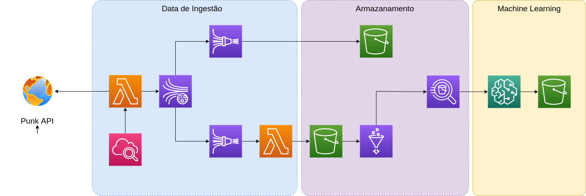

 

  <h1 align="center">MLOps Beer</h1>

<!-- SUMÁRIO -->

  
Sumário

  <ol>
    <li>
      <a href="#about-the-project">Sobre o projeto</a>
    </li>
    <li><a href="#getting-started">Pré Requisítos</a></li>
    <li><a href="#getting-started">Estrutura do Prejeto</a></li>
    <li><a href="#getting-started">Gerenciamento dos recursos com Terraform</a></li>
    <li><a href="#acknowledgements">Referências</a></li>
  </ol>

<!-- SOBRE -->
## Sobre o projeto

O propósito desse projeto é criar uma arquitetura utilizando os recursos da AWS que possibilite realizar a ingestão dos dados oferecidos pela Punk API e posteriormente com os dados coletados treine um modelo para prevê o IBU (International Bitter Unit), que representa uma escala, de 0 a 100, que mede o potencial de amargor conferido pelos lúpulos à cerveja.

### Dataset
Os dados estão disponível na API `https://api.punkapi.com/v2/beers/random` e será consolidado no S3, para que posteriormente seja possível treinar o modelo.

### Arquitetura

 
 
A cada 5 minutos o CloudWatch irá acionar uma função Lambda `fn_extraction`, que alimentará o Kinesis Stream.

Existirá dois Kinesis Firehose, um será responsável por salvar os dados brutos em um bucket no S3 com nome __raw__. O outro firehouse irá aplicar uma transformação que selecionar as features que serão utilizadas e salvar no bucket no S3 com nome de cleaned.

Depois iremos organizar os dados no bucket cleaned com o Glue Data Catalog e posteriormente realizar consultas utilizando o serviço Athena.

Para crição do modelo é utilizado o SageMaker para gerenciar todo o processo da contrução do modelo, desde a etapa do preprocessamento até o registro do modelo.

## Pré Requisítos
Para rodar este projeto é necessário que tenha as seguintes requisítos:

  - Terraform CLI
  - AWS CLI configurado com a conta AWS

## Estrutura do Projeto
 <ol>
    <li>
      <a href="#about-the-project"><strong>architecture: </strong> 
      </a>
      Arquitetura do projeto utilizando terraform
    </li>
    <li><a href="#getting-started"><strong>notebooks: </strong> </a>
      Notebooks utilizados no Notebook Instance AWS
    </li>
    <li><a href="#getting-started"><strong>src: </strong> </a>
    Código fonte do projeto
    <ul>
      <li><a href="#getting-started"><strong>lambda </strong> </a>
      Funções lambdas utilizadas na ingestão de dados
      </li>
      <li><a href="#getting-started"><strong>pipelines </strong> </a>
      Códigos utilizados nos pipelines de Machine Learning
      <li>
    </ul>
    </li>
  </ol>

## Gerenciamento dos recursos com Terraform

### `make terraform-init`
Este comando deve ser executado no inicio do projeto, para que faça o download de todas as depêndencias do terraform

### `make terraform-plan`
Mostrará as atualizações que serão realizadas pelo Terraform

### `make terraform-apply`
Aplicará as atualizações mostradas no comando `make terraform-plan` que serão realizadas pelo Terraform.

__Obs:__ Este comando utliza a opção `-auto-approve`, por isso tome cuidado ao executar este comando. 

### `make terraform-destroy`
Excluirá todos recursos gerenciados pelo Terraform.

<!-- REFERÊNCIAS -->
## Referências
* [Terraform Best Practices](https://www.terraform-best-practices.com/)
* [Deploying AWS Lambda with Terraform Quick Tutorial and Basic Concepts](https://lumigo.io/aws-lambda-deployment/aws-lambda-terraform/)
* [SageMaker Examples](https://github.com/aws/amazon-sagemaker-examples)
* [Amazon SageMaker Model Building Pipelines](https://docs.aws.amazon.com/sagemaker/latest/dg/pipelines.html)
* [Documentation - Amazon Pipelines](https://sagemaker.readthedocs.io/en/v2.35.0/workflows/pipelines/index.html)
* [Evolving Your Infrastructure with Terraform](https://www.youtube.com/watch?v=wgzgVm7Sqlk)
* [Terraform tutorial for beginners | deep dive of terraform | Infrastructure as Code](https://www.youtube.com/watch?v=5WykrpB7qS4)

